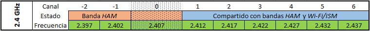
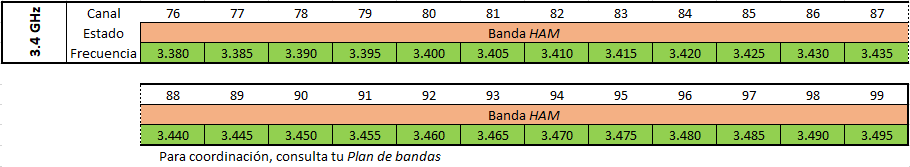
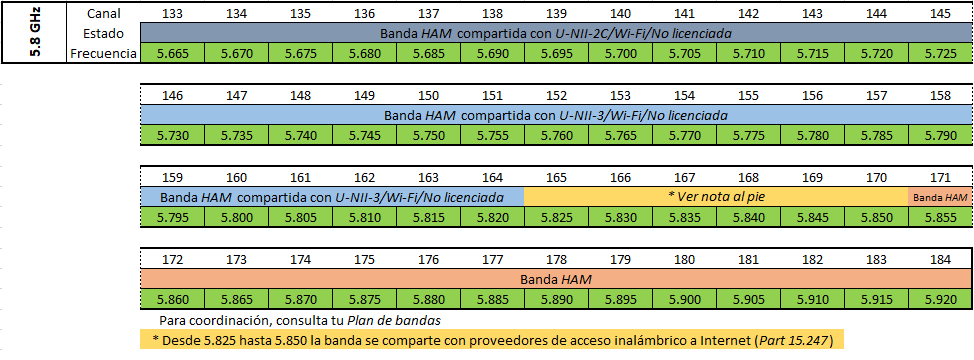

======================
Frecuencias y canales
======================

Las frecuencias y canales disponibles para la red AREDN |trade| se muestran a continuación.

**2.4 GHz**

**3.4 GHz**

**5.8 GHz**

.. |trade|  unicode:: U+00AE .. Registered Trademark SIGN
   :ltrim:
